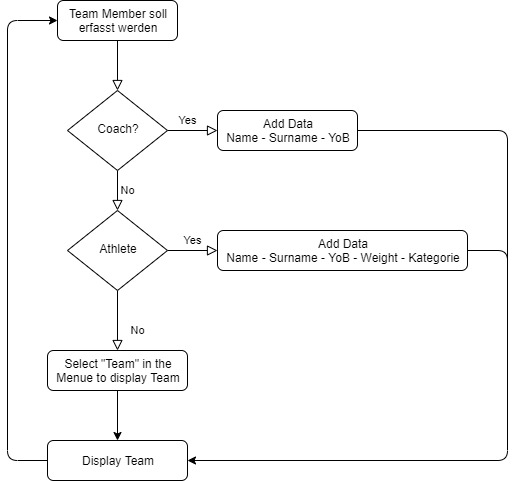

# Projektidee

## Erfassung Nationalteam Karate FL ##
Die Athleten und Coaches können sich im Formular eintragen. Die Coaches werden als "FYI" abgelegt und die Athleten erhalten Informationen in welchen Kategorien Sie mit Ihrem Jahrgang und Gewicht starten.

# Ablauf
1. Wahl Coach oder Athlet
2. Coach - Angaben Alter & Name & Vorname
3. Athleten:
4. Name & Vorname & Jahrgang & Gewicht & Kategorie
5. Speichern in CSV

# Flussdiagramm
